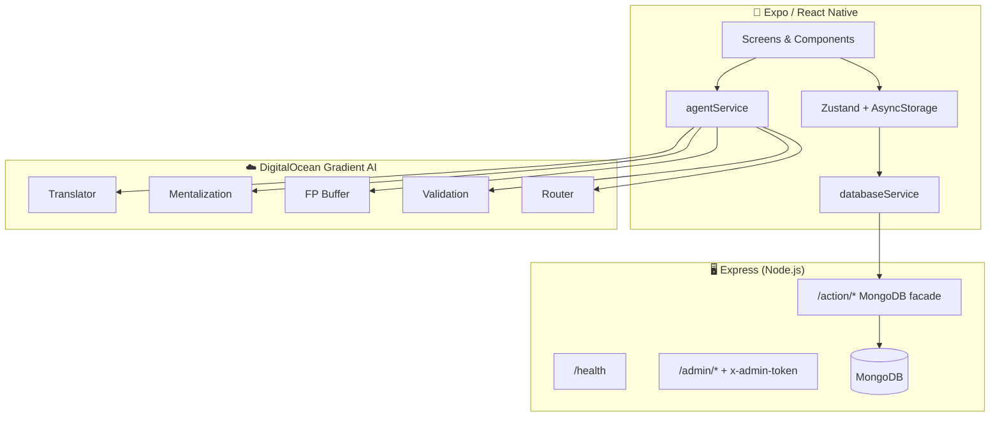

<p align="center">
  ⚓ <strong>Anchor</strong> — BPD recovery companion for patients, allies, and clinicians 🤝
</p>

<p align="center">
  📱 React Native · 🖥️ Express · 🍃 MongoDB · 🤖 Multi-agent AI
</p>

<p align="center">
  <a href="#-security-audit">🔒 Security</a> ·
  <a href="#-quick-start">🚀 Quick start</a> ·
  <a href="#-architecture">🏗️ Architecture</a> ·
  <a href="#-features">✨ Features</a> ·
  <a href="#-environment-variables">🔧 Env vars</a> ·
  <a href="#-backend-api">📡 API</a>
</p>

---

**Anchor** ⚓ (package: `bpd-recovery-app`, Expo slug: `anchor-bpd-recovery`) is a **React Native / Expo** 📱 mobile app with an **Express + MongoDB** 🖥️ backend. It supports three roles—**patient** 🧑‍⚕️, **ally** 💚, and **therapist** 👩‍⚕️—with DBT-informed tools 📚, mood tracking 📊, safety contracts 📜, and **five specialized AI agents** 🤖 on [DigitalOcean Gradient AI](https://docs.digitalocean.com/products/gradient-ai-platform/) ☁️.

> ⚠️ **Disclaimer:** This is a prototype for education and demonstration. It is **not** HIPAA-compliant, **not** FDA-cleared, and **must not** replace professional mental health care or emergency services. If you or someone else is in crisis, call **988** 🇺🇸 or your local emergency number 🆘.

| Component | Stack |
|-----------|--------|
| 📱 Mobile | React Native 0.81, Expo 54, TypeScript, Zustand, React Navigation |
| 🖥️ Backend | Express 5, Mongoose 9, MongoDB |
| 🤖 AI | DigitalOcean Gradient AI agents (chat completions API) |

**🔗 Upstream:** [github.com/rijuld/bpd](https://github.com/rijuld/bpd)

---

## 📑 Table of contents

- [🔒 Security audit](#-security-audit)
- [✨ Features](#-features)
- [🏗️ Architecture](#-architecture)
- [📁 Project structure](#-project-structure)
- [📋 Requirements](#-requirements)
- [🚀 Quick start](#-quick-start)
- [🔧 Environment variables](#-environment-variables)
- [📱 Mobile app](#-mobile-app)
- [📡 Backend API](#-backend-api)
- [🤖 AI agents](#-ai-agents)
- [🗄️ Data model](#-data-model)
- [🔄 Role flows](#-role-flows)
- [🛠️ Development](#-development)
- [🧪 Testing](#-testing)
- [🚢 Deployment notes](#-deployment-notes)
- [🔧 Troubleshooting](#-troubleshooting)
- [🗺️ Roadmap](#-roadmap)
- [📄 License](#-license)

---

## 🔒 Security audit

A full pass was done on **2026-05-21** 🗓️. Details live in [SECURITY.md](./SECURITY.md) 🛡️.

### ✅ Passed

| Item | Result |
|------|--------|
| 🔑 Hardcoded API keys, `sk-*`, `ghp_*`, `AKIA*`, MongoDB URIs with passwords | **None found** ✅ in source or git history |
| 📄 `.env` / `.env.*` committed | **None** ✅ — correctly gitignored |
| 🤖 Agent **access keys** in source | **Not committed** ✅ — only `process.env.EXPO_PUBLIC_*` |
| 📝 `docs.txt` | Vendor docs with `os.getenv()` **placeholders** only |

### ⚠️ Needs attention before production

| Severity | Issue | Location |
|----------|--------|----------|
| 🔴 **High** | Database routes (`/action/*`) have **no authentication** | `backend/server.js` |
| 🔴 **High** | Agent keys use `EXPO_PUBLIC_*` → **visible in the app bundle** 📦 | `mobile/src/services/agentService.ts` |
| 🟡 **Medium** | Login is **email-only** (no password) 🔓 | `mobile/src/store/useStore.ts` |
| 🟢 **Low** | Agent **endpoint URLs** are in source (not secret per DO, but identify your deployment) | `agentService.ts` |
| 🟢 **Low** | CORS allows all origins 🌐 | `backend/server.js` |

**💡 Recommendation:** Copy `backend/.env.example` and `mobile/.env.example` to `.env`, fill values locally, and **never commit** real secrets 🙅. For production, proxy AI calls through the backend and add real auth 🔐.

---

## ✨ Features

### 🧑‍⚕️ Patient — *"I am navigating recovery"*

| Screen | Capability |
|--------|------------|
| 🏠 **Home (The Helm)** | 1–10 mood slider 📊, daily DBT skill card 📚, quick actions ⚡ |
| 🧰 **Tools (The Toolbox)** | DBT skills library, FP Buffer, Mentalization Mirror 🪞, Journal 📓 |
| 👥 **My Team** | Link allies/therapists, granular share settings 🔗 |
| 🆘 **Crisis button** | Long-press **3 seconds** ⏱️ → crisis protocol modal (haptics 📳) |

### 💚 Ally — *"I am a supporter"*

| Screen | Capability |
|--------|------------|
| 📊 **Dashboard** | Linked patient status 🟢🟡🔴, burnout meter |
| 🌐 **Translator** | AI message translation & de-escalation 🤖 |
| 📖 **Learn** | Micro-lessons on supporting someone with BPD |

### 👩‍⚕️ Therapist — *"I am a clinician"*

| Screen | Capability |
|--------|------------|
| 📋 **Caseload** | Patients sorted by risk level |
| 📈 **Data stream** | Mood trends, crisis events, AI clinical summaries |
| 🔗 **Link patient** | Send/accept connection requests |

### 🤝 Shared

- 📜 **Safety contract** — multi-party digital agreement with terms and signatures ✍️
- 💬 **AI chat** — role-mapped agent (validation / translator / router) 🤖
- 🔗 **Connection requests** — patient ↔ therapist linking workflow
- 💾 **Persistent session** — Zustand + AsyncStorage

---

## 🏗️ Architecture



**🔀 Request paths**

1. 📊 **Data** — Mobile → `POST /action/{find|findOne|insertOne|updateOne}` → Mongoose → MongoDB collections.
2. 🤖 **AI** — Mobile → `POST {agent}.agents.do-ai.run/api/v1/chat/completions` with `Authorization: Bearer {key}`.
3. 🔐 **Admin** — `GET /admin/stats`, `POST /admin/wipe` (requires `x-admin-token` header).

---

## 📁 Project structure

```
bpd/
├── 📄 README.md                 # This file
├── 🛡️ SECURITY.md               # Security audit & checklist
├── 📝 docs.txt                  # DigitalOcean agent platform notes (reference)
├── 🖥️ backend/
│   ├── server.js             # Express API + MongoDB facade
│   ├── package.json
│   └── .env.example
└── 📱 mobile/
    ├── App.tsx               # Root navigation (auth vs main)
    ├── app.json              # Expo config ("Anchor")
    ├── package.json
    ├── .env.example
    └── src/
        ├── 🧩 components/       # CrisisButton, etc.
        ├── 🎨 constants/        # theme.ts (colors, spacing)
        ├── 📺 screens/
        │   ├── patient/      # Home, Tools, Team, tool sub-screens
        │   ├── ally/         # Dashboard, Translator, Learn
        │   ├── therapist/    # Caseload, DataStream, LinkPatient
        │   └── shared/       # Chat, SafetyContract
        ├── ⚙️ services/
        │   ├── databaseService.ts   # REST → backend
        │   └── agentService.ts      # DO Gradient AI
        ├── 🗃️ store/
        │   └── useStore.ts          # Global state + persistence
        └── 📐 types/
            └── index.ts
```

---

## 📋 Requirements

| Tool | Version |
|------|---------|
| 🟢 **Node.js** | 18+ |
| 📦 **npm** | 9+ |
| 🍃 **MongoDB** | 6+ (local or Atlas) |
| ⚡ **Expo CLI** | via `npx expo` |
| 🍎 **iOS** | Xcode + Simulator (macOS) |
| 🤖 **Android** | Android Studio + emulator |
| ☁️ **DigitalOcean** | Gradient AI agents + access keys (for AI features) |

---

## 🚀 Quick start

### 1️⃣ Clone and install

```bash
git clone https://github.com/rijuld/bpd.git
cd bpd

cd backend && npm install && cd ..
cd mobile && npm install && cd ..
```

### 2️⃣ Configure environment 🔧

```bash
cp backend/.env.example backend/.env
cp mobile/.env.example mobile/.env
```

Edit both `.env` files (see [Environment variables](#-environment-variables) 🔧).

### 3️⃣ Start MongoDB and backend 🍃

```bash
# Example: local MongoDB
mongod --dbpath ./data

cd backend
node server.js
# → Backend facade listening on port 3000
```

Verify ✅:

```bash
curl http://localhost:3000/health
# {"ok":true}
```

### 4️⃣ Start mobile app 📱

```bash
cd mobile
npx expo start
```

Press `i` 🍎 (iOS simulator), `a` 🤖 (Android), or scan QR 📷 for Expo Go on a physical device.

**📲 Physical device tip:** Set `EXPO_PUBLIC_BACKEND_URL=http://<your-computer-lan-ip>:3000` in `mobile/.env`.

---

## 🔧 Environment variables

### 🖥️ Backend (`backend/.env`)

| Variable | Required | Description |
|----------|----------|-------------|
| `MONGODB_URI` | ✅ Yes | MongoDB connection string |
| `ADMIN_TOKEN` | ✅ Yes* | Secret for `/admin/*` routes (`x-admin-token` header) |
| `PORT` | ➖ No | HTTP port (default `3000`) |
| `WIPE_ON_START` | ➖ No | If `true`, deletes all app collections on startup (**dev only** 🧪) |

\*Required if you use admin endpoints.

### 📱 Mobile (`mobile/.env`)

| Variable | Required | Description |
|----------|----------|-------------|
| `EXPO_PUBLIC_BACKEND_URL` | ✅ Yes | Backend base URL |
| `EXPO_PUBLIC_AGENT_KEY_TRANSLATOR` | 🤖 For AI | DO agent access key |
| `EXPO_PUBLIC_AGENT_KEY_MENTALIZATION` | 🤖 For AI | DO agent access key |
| `EXPO_PUBLIC_AGENT_KEY_FP_BUFFER` | 🤖 For AI | DO agent access key |
| `EXPO_PUBLIC_AGENT_KEY_VALIDATION` | 🤖 For AI | DO agent access key |
| `EXPO_PUBLIC_AGENT_KEY_ROUTER` | 🤖 For AI | DO agent access key |

> ⚠️ **Expo note:** Any variable prefixed with `EXPO_PUBLIC_` is embedded in the client build 📦. Do **not** treat these as server-side secrets in production.

### 🌐 Backend URL cheat sheet

| Environment | `EXPO_PUBLIC_BACKEND_URL` |
|-------------|---------------------------|
| 🍎 iOS Simulator | `http://localhost:3000` |
| 🤖 Android Emulator | `http://10.0.2.2:3000` |
| 📲 Physical device | `http://<your-lan-ip>:3000` |

---

## 📱 Mobile app

### 🧭 Navigation

```
Unauthenticated:
  👋 Welcome → Onboarding (role select + register) | Login (email lookup)

Authenticated (role-based tabs):
  🧑‍⚕️ patient:   Home | Tools | Team
  💚 ally:      Dashboard | Translator | Learn
  👩‍⚕️ therapist: Caseload | Data Stream

Stack overlays (all roles):
  💬 Chat, SafetyContract, SkillsLibrary, SkillDetail, Journal,
  FPBuffer, MentalizationMirror, LinkPatient, PatientDetail
```

### 🗃️ State management (`useStore`)

Persisted to AsyncStorage (`bpd-recovery-storage`) 💾:

- `user`, `isAuthenticated`, `selectedRole`
- `shareSettings`, `moodLogs`, `linkedAccounts`

Actions include `registerUser`, `loginUser`, `saveMoodToDatabase`, connection request helpers, and chat history.

### ⚙️ Key services

**`databaseService.ts`** — MongoDB Data API–style facade 🍃:

```typescript
POST ${API_BASE_URL}/action/findOne   { collection, filter }
POST ${API_BASE_URL}/action/find      { collection, filter, sort?, limit? }
POST ${API_BASE_URL}/action/insertOne { collection, document }
POST ${API_BASE_URL}/action/updateOne { collection, filter, update }
```

**`agentService.ts`** — Direct DigitalOcean agent calls 🤖:

```typescript
POST {endpoint}/api/v1/chat/completions
Authorization: Bearer {accessKey}
{ messages, stream: false, include_retrieval_info: false }
```

Role → default agent mapping 🎯:

| Role | Agent |
|------|-------|
| 🧑‍⚕️ `patient` | `validation` |
| 💚 `ally` | `translator` |
| 👩‍⚕️ `therapist` | `router` |

---

## 📡 Backend API

Base URL: `http://localhost:3000` (or `PORT` from env).

### 🌍 Public

| Method | Path | Body | Response |
|--------|------|------|----------|
| `GET` | `/health` | — | `{ ok: true }` ✅ |
| `POST` | `/action/findOne` | `{ collection, filter }` | `{ document }` |
| `POST` | `/action/find` | `{ collection, filter, sort?, limit? }` | `{ documents }` |
| `POST` | `/action/insertOne` | `{ collection, document }` | `{ insertedId }` |
| `POST` | `/action/updateOne` | `{ collection, filter, update }` | `{ matchedCount, modifiedCount }` |

**`$oid` support:** Filters may use `{ field: { $oid: "<hex>" } }` for MongoDB ObjectIds (parsed recursively in `parseFilter`).

### 🔐 Admin (authenticated)

Header: `x-admin-token: <ADMIN_TOKEN>`

| Method | Path | Description |
|--------|------|-------------|
| `GET` | `/admin/stats` | 📊 Document counts per collection |
| `POST` | `/admin/wipe` | 🗑️ Deletes all documents in app collections |

Collections managed 📚:

- 👤 `users`
- 📊 `mood_logs`
- 📜 `safety_contracts`
- 🔗 `connection_requests`
- 🤝 `linked_accounts`

### 💻 Example: create a user

```bash
curl -X POST http://localhost:3000/action/insertOne \
  -H "Content-Type: application/json" \
  -d '{
    "collection": "users",
    "document": {
      "id": "user_demo_1",
      "email": "demo@example.com",
      "name": "Demo Patient",
      "role": "patient",
      "createdAt": "2026-01-01T00:00:00.000Z"
    }
  }'
```

---

## 🤖 AI agents

Five [DigitalOcean Gradient AI](https://docs.digitalocean.com/products/gradient-ai-platform/) ☁️ agents, configured in `mobile/src/services/agentService.ts`:

| Agent | Purpose | Used by |
|-------|---------|---------|
| 🌐 **Translator** | De-escalation & message reframing for allies | Ally translator, `translateMessage()` |
| 🪞 **Mentalization** | Reflect mental states behind communications | Mentalization Mirror tool |
| 🛡️ **FP Buffer** | Favorite-person boundary support | FP Buffer tool |
| 💚 **Validation** | Dialectical validation for patients | Patient chat, `getValidation()` |
| 🔀 **Router** | Clinical routing & summaries | Therapist chat, `getClinicalSummary()` |

Endpoint hostnames are committed in source; **access keys must come from env** 🔑 (see `mobile/.env.example`).

### 💬 Chat completions request

```json
{
  "messages": [
    { "role": "user", "content": "..." }
  ],
  "stream": false,
  "include_retrieval_info": false
}
```

### 🧠 Conversation history

`agentService` keeps an in-memory history per session (`clearHistory()`, `getHistory()`). History is **not** persisted to MongoDB by default.

Reference documentation: [`docs.txt`](./docs.txt) 📝 (DO agent endpoints, public vs private, embed notes).

---

## 🗄️ Data model

### 👤 `users`

```typescript
{
  id: string;
  email: string;
  name: string;
  role: 'patient' | 'ally' | 'therapist';
  bloomCode?: string;
  linkedPatientId?: string;
  shareSettings?: ShareSettings;
  createdAt?: string;
  updatedAt?: string;
}
```

### 📊 `mood_logs`

```typescript
{
  userId: string;
  level: number;      // 1–10
  timestamp: string;
  note?: string;
}
```

### 📜 `safety_contracts`

```typescript
{
  patientId: string;
  allyId?: string;
  therapistId?: string;
  terms: ContractTerm[];
  signedByPatient: boolean;
  signedByAlly: boolean;
  signedByTherapist: boolean;
  lastUpdated: string;
}
```

### 🔗 `connection_requests`

```typescript
{
  id: string;
  fromUserId: string;
  fromUserRole: string;
  toUserId: string;
  toUserRole: string;
  status: 'pending' | 'accepted' | 'rejected';
  createdAt: string;
}
```

### 🤝 `linked_accounts`

```typescript
{
  patientId: string;
  linkedUserId: string;
  linkedUserRole: string;
  createdAt: string;
}
```

### 🔒 Share settings (on user)

```typescript
{
  shareMoodGraph: boolean;
  shareJournalEntries: boolean;
  shareCrisisEvents: boolean;
  shareSkillUsage: boolean;
}
```

---

## 🔄 Role flows

### 🔐 Registration & login

1. 👋 **Welcome** → **Onboarding**: pick role, enter name + email → `registerUser()` → `insertOne` on `users`.
2. 🔑 **Login**: email lookup only → `getUserByEmail()` → session restored from AsyncStorage.

There is **no password** in the current prototype 🔓.

### 🔗 Patient ↔ therapist linking

1. 📤 Therapist (or patient) sends a **connection request** via `sendConnectionRequest`.
2. 📥 Recipient sees pending requests in **Team** / caseload UI.
3. ✅ **Accept** → updates request status + creates `linked_accounts` row.
4. ❌ **Reject** → status `rejected`.

### 📊 Mood tracking

1. 🏠 Patient adjusts slider on **Home**.
2. 💾 `saveMoodToDatabase()` writes to `mood_logs` and updates local Zustand state.
3. 📈 Therapist **Data stream** reads logs when share settings allow (UI-dependent).

### 🆘 Crisis protocol

1. ⏱️ User **holds** the floating crisis button for **3 seconds** (progress ring + haptics 📳).
2. 📋 Modal presents crisis resources / next steps (configure per deployment).

---

## 🛠️ Development

### 📜 Scripts

**Backend** 🖥️

```bash
cd backend
node server.js
```

**Mobile** 📱

```bash
cd mobile
npm start          # Expo dev server
npm run ios
npm run android
npm test           # Jest
```

### 🎨 Theming

`mobile/src/constants/theme.ts` defines:

- Role accent colors (`cardPatient`, `cardAlly`, `cardTherapist`)
- Status colors 🟢 / 🟡 / 🔴
- Spacing, typography, border radii

### ➕ Adding a new screen

1. Create component under `mobile/src/screens/`.
2. Register in `App.tsx` (`MainNavigator` stack or role tab navigator).
3. Wire navigation from an existing screen; use `useStore()` for shared state.

### ➕ Adding a new collection

1. Add name to `COLLECTIONS` in `databaseService.ts`.
2. Optionally add to `COLLECTIONS_TO_WIPE` in `backend/server.js` if it should participate in admin wipe.
3. Implement service methods using `makeRequest()`.

---

## 🧪 Testing

```bash
cd mobile
npm test
```

Includes navigation smoke tests under `mobile/__tests__/`. ✅

Backend has no automated tests yet (`package.json` placeholder) ⏳.

---

## 🚢 Deployment notes

### 🚧 What this prototype is missing for production

- [ ] 🔐 Authentication on `/action/*` (JWT, sessions, or API keys)
- [ ] 🔑 Password/OAuth login
- [ ] 🤖 Backend proxy for AI (hide agent keys)
- [ ] 🔒 HTTPS / TLS termination
- [ ] 🍃 MongoDB auth + IP allowlist
- [ ] ⏱️ Rate limiting & input validation
- [ ] 🏥 HIPAA / privacy review, BAAs, audit logging
- [ ] 🆘 Crisis hotline integration verified per region

### 🏗️ Suggested production topology

```
📱 Mobile app  →  🌐 API Gateway (HTTPS)  →  🖥️ Express backend
                                      ├─ 🍃 MongoDB Atlas (private VPC)
                                      └─ 🤖 DO Gradient AI (server-side keys)
```

### 📲 App store identifiers

| Platform | Identifier |
|----------|------------|
| 🍎 iOS | `com.anchor.bpdrecovery` |
| 🤖 Android | `com.anchor.bpdrecovery` |

---

## 🔧 Troubleshooting

| Problem | Fix |
|---------|-----|
| 📱 Mobile cannot reach backend | Check `EXPO_PUBLIC_BACKEND_URL`; use LAN IP on physical devices |
| 🍃 `MongoDB connection error` | Verify `MONGODB_URI`; ensure `mongod` or Atlas is running |
| 🤖 AI returns 401 | Set all five `EXPO_PUBLIC_AGENT_KEY_*` in `mobile/.env`; restart Expo |
| 💬 AI returns empty | Confirm agent endpoints are **private** and keys match DO dashboard |
| 🔐 Admin wipe 401 | Send header `x-admin-token: $ADMIN_TOKEN` |
| 🗑️ Stale data in dev | `POST /admin/wipe` or set `WIPE_ON_START=true` once |

---

## 🗺️ Roadmap

Ideas aligned with the current codebase:

- 🔐 Backend auth middleware for `/action/*`
- 🤖 Server-side AI proxy route (`POST /ai/chat`)
- ✉️ Passwordless magic link or OAuth (Apple / Google)
- 🔔 Push notifications for therapist interventions
- 🔒 Encrypted journal entries
- 🏥 FHIR-friendly export for clinicians
- 📴 Offline mood logging with sync queue

---

## 📄 License

No `LICENSE` file is present in this repository. Confirm terms with the maintainer before redistribution.

For security issues 🛡️, see [SECURITY.md](./SECURITY.md).

---

<p align="center">
  ⚓ Built with care for recovery support — deploy responsibly 💙
</p>
